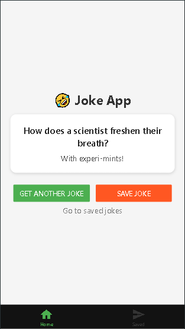
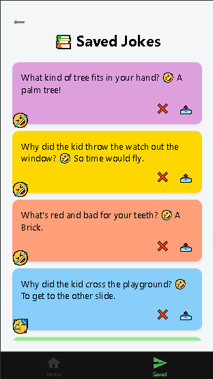

# 🤣 Jokes App

Una aplicación de **React Native con Expo** que muestra chistes aleatorios desde una API, permite **guardarlos**, **evitar duplicados**, **eliminarlos** y **compartirlos**.  
Incluye un diseño con **tarjetas coloridas** y **persistencia local con AsyncStorage**.

---

## ✨ Características

- 🔀 Obtener chistes aleatorios desde la API [Official Joke API](https://github.com/15Dkatz/official_joke_api)  
- 💾 Guardar chistes en memoria persistente (AsyncStorage)  
- 🚫 Evitar duplicados al guardar  
- ❌ Eliminar chistes individuales o todos  
- 📤 Compartir chistes con otras apps (WhatsApp, Instagram, etc.)  
- 🎨 Estilo con tarjetas coloridas y emojis divertidos  

---

## 📸 Capturas de pantalla

| Home | Saved Jokes |
|------|-------------|
|  |  |

---

## 🛠️ Tecnologías utilizadas

- [React Native](https://reactnative.dev/)  
- [Expo](https://expo.dev/)  
- [AsyncStorage](https://docs.expo.dev/versions/latest/sdk/async-storage/)  
- [React Context](https://reactjs.org/docs/context.html)  

---

## 🚀 Instalación y ejecución

Clona el repositorio:

```bash
git clone https://github.com/ZoeG00/MiniJokes-App.git
cd minijokes-app

---
## 👩‍💻 Autor

- Zoe Guzmán
- |[💼 LinkedIn](https://www.linkedin.com/in/zoeg00) | [🌐 Portafolio](https://zoeguzman-portfolio.vercel.app/)
